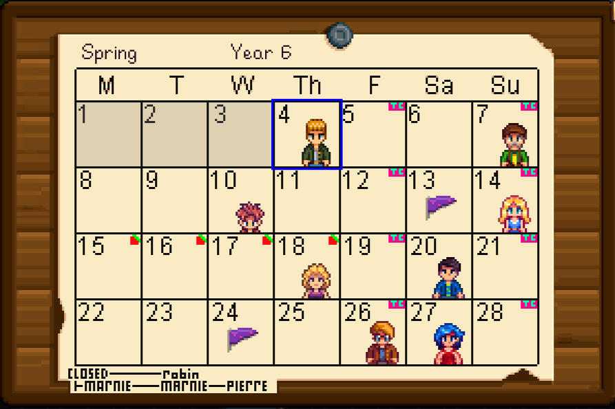
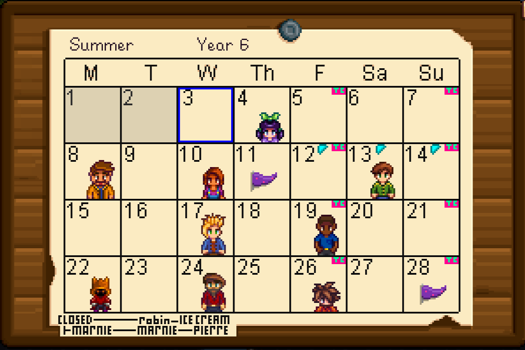
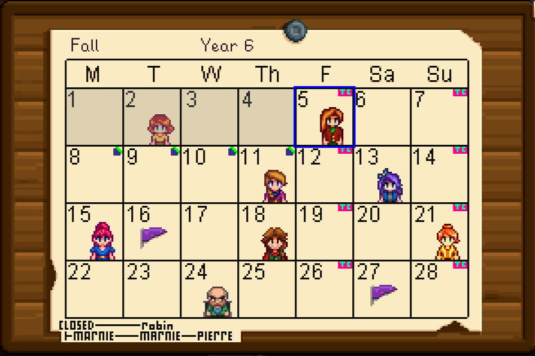
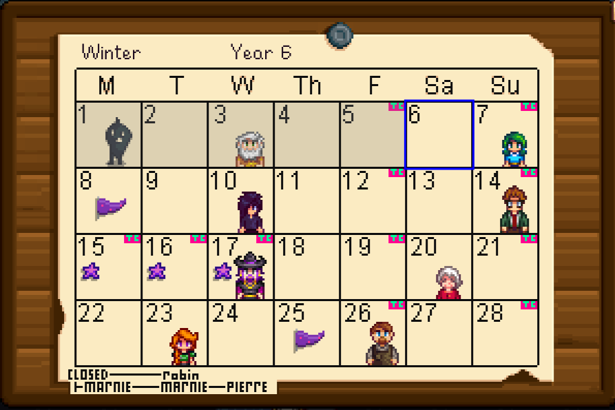

# Expanded Calendar

## Installation

1. Go to the [latest release](https://github.com/VMPYRC/ExpandedCalendar/releases)
2. Download the .zip file attached
3. Extract
4. Move to Mods folder
5. Start Game
6. Enjoy
7. Report any issues [here](https://github.com/VMPYRC/ExpandedCalendar/issues)

## Additions

| Season | Additions                                                                                                                     | Image                        |
| :----: | ----------------------------------------------------------------------------------------------------------------------------- | ---------------------------- |
|  ALL   | + Closed Days for: Marnie's Ranch, Robin / Carpenter's Shop, Pierre's General Store, Ice Cream Stand + Traveling Cart Days | NONE                         |
| Spring | Salmonberry                                                                                                                   |  |
| Summer | Beach Forageables                                                                                                             |  |
|  Fall  | Blackberry                                                                                                                    |      |
| Winter | Traveling Cart on Night Market Days                                                                                           |  |
